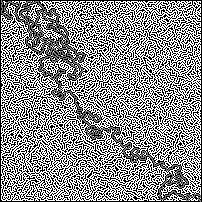

# Mazemerise-cpp - a maze generator and solver written in C++
___
Mazemerise is a time and memory-efficient maze generator and solver written in C++. It contains no external libraries and uses the .pgm image format to output images. Info about the program's design can be found in the source code itself, which is thoroughly commented with brief, intuitive explanations. Mazemerise is licenced under GNU GPL 3.0.
### Examples
50 x 50:\

200 x 200:\

### Usage
The maze generator accepts a file name, followed by width and height respectively (e.g. `./generate output.pgm 50 50` on Linux systems). 
The maze solver accepts an input file path to a valid maze of the same format as one of the program's outputs, and then accepts an output file name (e.g. `./solve input.pgm output.pgm` on Linux systems).
